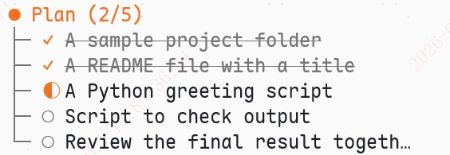

# plan-mode

Claude Code-style **Plan / Auto / Edit** mode manager for the [pi coding agent](https://github.com/earendil-works/pi).

Pi ships without a plan mode (see [earendil-works/pi#97](https://github.com/earendil-works/pi/issues/97) — "Add plan mode support"). This extension adds the full workflow:

- **Plan** — read-only exploration & planning (edit/write/bash hard-blocked)
- **Auto** — full tool access, executes directly
- **Edit** — read/write tools + search; bash requires per-command approval

The agent produces a numbered plan, the extension tracks its steps in a live todo widget, and the agent reports progress with `[DONE:n]` markers as it executes.


## Screenshot



The live todo widget sits below the editor: a `Plan (2/5)` heading on a timeline, with completed (`✓`), in-progress (`◐`) and pending (`○`) glyphs, a progress counter that ticks up as steps complete, and an auto-hide + 🎉 notification when the whole plan finishes.

## Features

- 🔄 **`Alt+M`** cycles modes: Auto → Plan → Edit
- 🔒 **Hard gate** on tool calls — Plan mode rejects `edit`/`write`/`bash` before the agent sees them; Edit mode prompts for bash approval
- 📋 **Live todo widget** (below the editor) — numbered plan steps with progress counter (`Plan (2/5)`), pending/current/done glyphs (`◐`/`○`/`✓`) **colored to match the active mode** (teal in Plan, orange-red in Auto, blue in Edit), auto-hides when the plan completes
- ✨ **Two-column layout** — todo lists > 5 items split into side-by-side columns (CJK-width aware, truncation-safe)
- ✅ **`[DONE:n]` protocol** — cumulative semantics: `[DONE:3]` marks steps 1–3 complete; `[DONE:all]`/`[DONE:*]` marks everything
- 🧠 **Mode instructions injected into context** — the agent knows which mode is active and what its rules are
- 💾 **Session persistence** — todos survive restarts (the manager always auto-starts in Auto mode unless `--plan`); plans are recovered from session history even if the extension was enabled after the plan was written
- ⌨️ **`/plan` toggle** and `--plan` CLI flag (start pi directly in Plan mode); the manager **auto-starts in Auto mode** on every launch, no manual enabling needed

## Installation

### From GitHub

```bash
pi install git:github.com/pkulyn/plan-mode@v1
```

> ℹ️ **npm**: this package is not published to the npm registry — the name `plan-mode` there belongs to an unrelated project by another author. Install from GitHub above (or manually below) instead.

### Manual

Clone the repo and add it to your extension paths in `~/.pi/agent/settings.json`:

```json
{
  "extensions": ["/path/to/plan-mode"]
}
```

The extension auto-loads on the next pi session. Requires **pi ≥ 0.80** and **Node ≥ 23.6**.

## Usage

| Action | Result |
|--------|--------|
| `/plan` | Toggle mode manager on/off |
| `Alt+M` | Cycle mode: Auto → Plan → Edit |
| `/todos` | Show the current plan todo list |
| `pi --plan` | Start pi with Plan mode already active |

### Workflow

1. pi starts with the mode manager **auto-enabled in Auto mode** (or `pi --plan` to start directly in Plan mode). Press `Alt+M` to enter **Plan**: the agent explores the codebase and produces a plan wrapped in a `<todo>` block. Tools that modify anything are blocked.
2. Press `Alt+M` to cycle **Auto → Plan → Edit → Auto**: **Auto** executes directly, **Edit** is focused editing with bash approval.
3. As the agent executes each step it reports `[DONE:n]`. The todo widget ticks up `(1/5) → (5/5)` and collapses with a 🎉 notification when the plan is done.

### Tool access matrix

| Mode | read / grep / find / ls | edit / write | bash | other tools |
|------|:---:|:---:|:---:|:---:|
| **Plan** | ✅ | ❌ blocked | ❌ blocked | ✅ |
| **Auto** | ✅ | ✅ | ✅ | ✅ |
| **Edit** | ✅ | ✅ | ⚠️ per-command approval | ✅ |

### `[DONE:n]` protocol

The agent signals completed plan steps in its response text:

```
Plan:
1. Refactor the parser
2. Add tests
3. Update docs

[DONE:2]
```

Cumulative semantics: `[DONE:2]` marks steps 1 *and* 2 complete (plan steps execute in order). `n` may exceed the list length (the agent may count its own steps). `[DONE:all]` / `[DONE:*]` mark every step complete.

Only **standalone** markers count — markers inside range/list expressions such as `[DONE:1]~[DONE:5]` (prose examples) are ignored, so text that merely mentions the marker syntax cannot false-complete steps.

## How it works

- **Tool gating** — `tool_call` interception returns `{ block: true, reason }` for disallowed tools; no shell-level sandboxing
- **Plan extraction** — scans assistant messages for `Plan:` headers + numbered lists (`extractTodoItems`), cleans step text (verb-stripping, markdown removal, truncation)
- **Progress tracking** — `turn_end` parses `[DONE:n]` markers (standalone only; range expressions ignored); the completion toast fires only when a turn actually transitions the plan to fully done, so it never re-fires on a restored/already-finished plan. Completion state is rebuilt from session history on restore, so the widget survives restarts
- **Context injection** — `before_agent_start` inserts mode instructions (tagged `customType`) filtered by `context` interception

## Development

```bash
npm test          # node:test — zero dependencies
```

Tests cover the pure utilities (`utils.ts`): plan extraction, `[DONE:n]` cumulative semantics, CJK-aware layout (`columnarize`, `displayWidth`, `truncateToWidth`), and ANSI handling.

## Compatibility notes

- Uses pi's public extension APIs (`setActiveTools`/`getActiveTools`, `ctx.ui.setWidget`, `appendEntry`, lifecycle events) — see [extensions.md](https://github.com/earendil-works/pi/blob/main/docs/extensions.md)
- Mode colors are hard-coded ANSI (`MODE_ANSI` in `index.ts` — Plan teal / Auto orange-red / Edit blue), and the todo widget glyphs follow the active mode color; adjust to taste
- If the official pi plan mode ever lands, this extension can serve as a migration reference

## License

[MIT](LICENSE)
